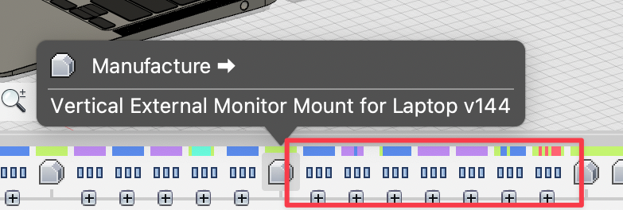
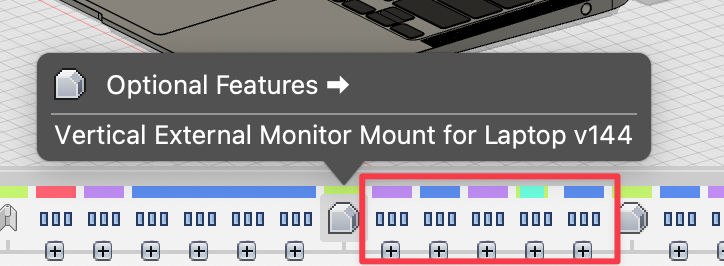

# Parameter Sets for 3D Printing

Import the CSVs with the [Parameter I/O](https://apps.autodesk.com/FUSION/en/Detail/Index?id=1801418194626000805) plugin.

Note that you will need to suppress/unsuppress manufacture-related feature groups before 3D printing:

Also, check for the optional features are suppressed/unsuppressed as your needs (as they might be changed automatically during suppress/unsuppressing manufacture-related features):

## For FDM

Unsuppress the following feature groups:

* `[Optional-Manufacture][default-on] 3D Printing Body Splits` - to let the main body have a flat face to print nicely on the print bed.
* `[Optional-Manufacture] TPU 3D Printing Offsets` - I don't know why but they works for me.

**Suppress all other feature groups in the manufacture section.**

## For Resin 3D Printing

> Mainly for CHITUBOX, printing directly on the build plate.

Unsuppress the following feature groups:

* `[Optional-Manufacture] Monitor Slot Z Offsets`
* `[Optional-Manufacture][default-on] 3D Printing Body Splits` - to let the main body have a flat face to print nicely on the build plate.

And...

* `[Optional-Manufacture][Slow!] Non-generatable Resin 3D Print Supports for leg`.
* `[Optional-Manufacture][Slow!] Non-generatable Resin 3D Print Supports for main body`.
* `[Optional-Manufacture] Non-generatable Resin 3D Print Supports for other parts`.

as some spaces are too small that it's impossible to place supports with CHITUBOX; also they provides frames to prevent CHITUBOX from generating supports that will stick to the model body, and provide removable handles that makes things easier to remove the model from the build plate.

Optional:
* `[Optional-Manufacture] For Small 3D Printers` - limit the length of the legs, if you have a small 3D printer.

**Suppress all other feature groups in the manufacture section.**

## For SLS

**Suppress ALL** feature groups in the manufacture section, including `[Optional-Manufacture][default-on] 3D Printing Body Splits`.
