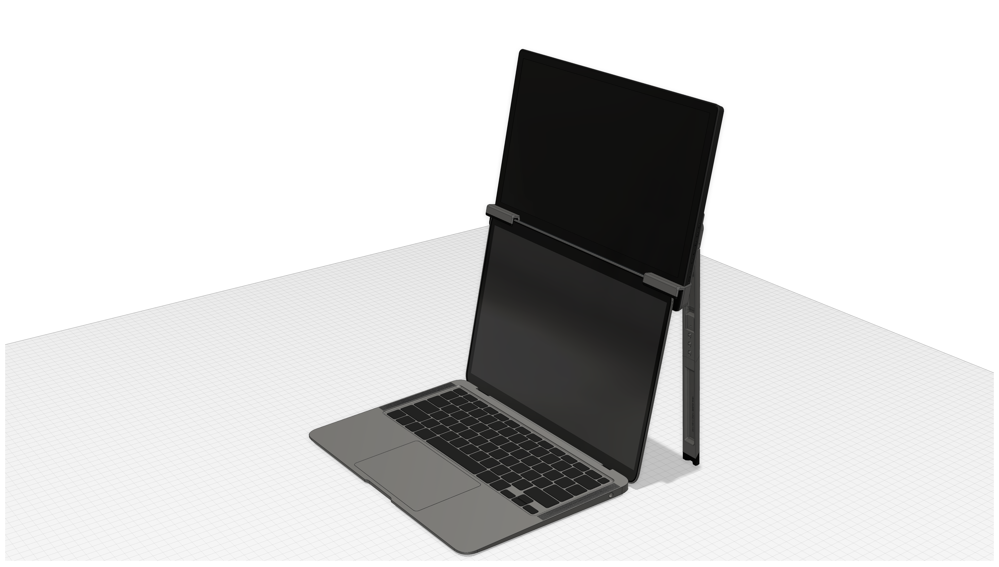

# Vertical External Monitor Mount for Laptop

Mount an external monitor on top of your laptop's built-in monitor—benefits your digital nomad experience and your neck.

Built with Fusion 360, parameters can be modified to fit varies models of external monitors and laptops.

*MacBook Air 3D model from 
[Kubil on GrabCAD](https://grabcad.com/library/macbook-air-2019-1). The external monitor shown in the picture is a [UPERFECT 13.3" 4K Portable Monitor](https://grabcad.com/library/uperfect-4k-portable-monitor-for-laptop-13-3-uhd-3840x2160-1).*

## Usage

See the full video of assemble and usage on YouTube: https://youtu.be/1Dmn62khUAA.

## Manufacture

This product can be 3D printed with FDM or Resin 3D printers. See https://hackmd.io/@z/vemml-manufacture.
